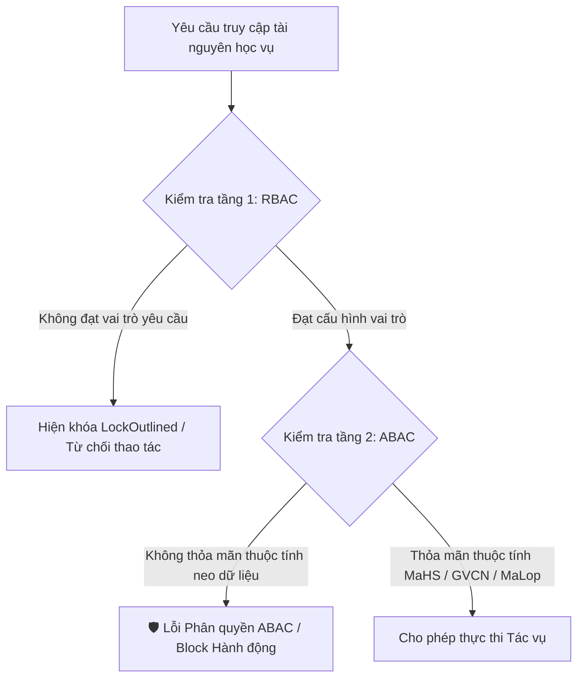
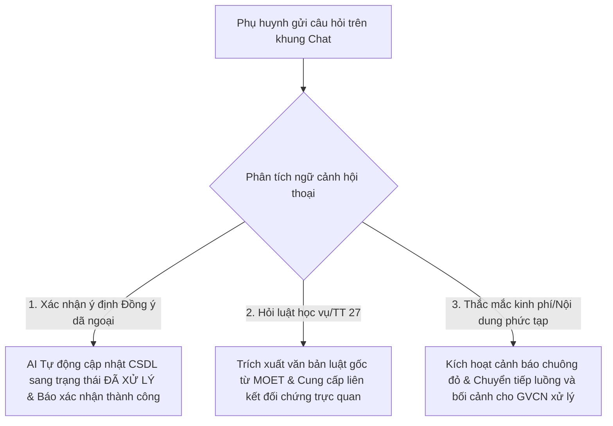

# CHƯƠNG: KẾT QUẢ TRIỂN KHAI GIAO DIỆN HỆ THỐNG QUẢN LÝ HỌC VỤ

---

## 1. TỔNG QUAN KIẾN TRÚC FRONT-END

Hệ thống quản lý học vụ tiểu học (TH Hàm Chính 2) được thiết kế và xây dựng theo mô hình Client-Server hiện đại, tách biệt hoàn toàn giữa tầng xử lý nghiệp vụ/dữ liệu ở Backend (ASP.NET Core API) và tầng tương tác người dùng ở Frontend. Kiến trúc Frontend của dự án áp dụng các công nghệ tiên tiến nhất hiện nay, cụ thể như sau:

### 1.1. Các công nghệ cốt lõi cấu thành hệ thống giao diện
*   **Next.js (App Router v15):** Đóng vai trò là nền tảng quản lý luồng dữ liệu (Routing) và hiển thị. Sử dụng cơ chế App Router cung cấp khả năng tối ưu hóa sơ đồ cấu trúc thư mục dạng thư mục module hóa. Cụ thể, các trang được tổ chức mạch lạc bên dưới đường dẫn `src/app/modules/`, giúp cô lập phạm vi nghiệp vụ và tách biệt mối quan tâm (Separation of Concerns). Layout gốc `layout.tsx` kết hợp đối tượng đăng ký `AntdRegistry` từ thư viện `@ant-design/nextjs-registry` để đảm bảo cơ chế Render phía máy chủ (SSR) không làm gián đoạn hoặc xung đột CSS với các thành phần giao diện động.
*   **TypeScript:** Đóng vai trò kiểm soát kiểu dữ liệu nghiêm ngặt trong quá trình phát triển (Static Typing). Các cấu trúc giao diện chính như thông tin học sinh (`Student`), lịch phân công (`Schedule`), bản ghi điểm số (`GradeRecord`), thông báo học vụ (`Announcement`), hóa đơn đọc (`ReadReceipt`), và định dạng thông điệp AI (`ChatMessage`) đều được ràng buộc chặt chẽ thông qua các Interface rõ ràng. Điều này giúp đẩy lỗi kiểm thử tĩnh lên giai đoạn biên dịch, hạn chế tối đa các lỗi runtime.
*   **Ant Design (v5):** Cung cấp hệ thống các thành phần giao diện nâng cao (UI Components) được quy chuẩn hóa cao bao gồm: Bảng dữ liệu thông minh (`Table`), Hộp thoại phụ (`Modal`), Kiến trúc phân chia thẻ (`Tabs`), Hệ thống biểu mẫu chứa quy tắc kiểm tra (`Form` + `rules`), Menu điều hướng (`Menu`), và các thành phần phản hồi trực quan (`Alert`, `Tag`, `Badge`, `Progress`, `message`).
*   **Tailwind CSS (v4):** Công cụ định kiểu Utility-first phối hợp chặt chẽ với Ant Design nhằm tinh chỉnh bố cục đáp ứng (Responsive Grid System) và các thông số khoảng cách, màu sắc, hiệu ứng hoạt ảnh vi mô (micro-animations như `animate-pulse`, `animate-bounce`) mang lại giao diện trực quan, đồng bộ và chuyên nghiệp.

### 1.2. Cơ chế liên kết API Client đồng bộ và xác thực bảo mật JWT
Để thực hiện liên kết dữ liệu giữa máy khách (Client) và máy chủ dịch vụ (ASP.NET Core API tại địa chỉ `http://localhost:5076/api`), dự án triển khai một module gọi dịch vụ tập trung đặt tại `src/services/apiClient.ts`. 

```typescript
import axios from 'axios';

const baseURL = process.env.NEXT_PUBLIC_API_URL || 'http://localhost:5076/api';

const apiClient = axios.create({
  baseURL,
  headers: {
    'Content-Type': 'application/json',
  },
  timeout: 10000, 
});
```

Cơ chế vận hành của lớp kết nối mạng này bao gồm hai thành phần Interceptor cốt lõi:

1.  **Request Interceptor (Bộ chặn yêu cầu):**
    Trước khi một yêu cầu HTTP được truyền tải đi từ Client, bộ chặn sẽ thực hiện kiểm tra vùng nhớ lưu trữ của trình duyệt (`localStorage`). Nếu sự hiện diện của mã khóa xác thực JWT (JSON Web Token) được tìm thấy dưới khóa `token`, API Client sẽ tự động cấu hình thuộc tính `Authorization` trên thẻ tiêu đề HTTP (Header Request) theo quy chuẩn Bearer Token:
    $$\text{Authorization: Bearer } \langle \text{JWT\_Token} \rangle$$
    Cơ chế này áp dụng nhất quán trên toàn bộ các yêu cầu lấy thông tin học sinh, chỉnh sửa điểm số hay tương tác gửi thông báo, loại bỏ hoàn toàn việc đính kèm mã xác thực thủ công.
2.  **Response Interceptor (Bộ chặn phản hồi):**
    Thực hiện chức năng xử lý lỗi tập trung đối với các mã trạng thái phản hồi từ máy chủ:
    *   **Trạng thái 401 (Unauthorized):** Báo hiệu phiên làm việc hết hạn hoặc token không hợp lệ. Hệ thống sẽ tự động dọn sạch vùng nhớ trình duyệt thông qua lệnh `localStorage.removeItem('token')` nhằm đảm bảo an toàn thông tin và sẵn sàng định tuyến người dùng về trang đăng nhập.
    *   **Trạng thái 403 (Forbidden):** Ngăn chặn hiển thị hoặc thông báo cảnh báo lỗi phân quyền khi tài khoản cố tình thực hiện các tác vụ vượt quá thẩm quyền của vai trò hiện hành.

---

## 2. CƠ CHẾ BẢO MẬT 2 TẦNG TRÊN GIAO DIỆN (RBAC & ABAC)

Giải pháp bảo mật trên giao diện của hệ thống được lập trình giả lập trực quan theo cơ chế phân quyền kép nhằm bảo vệ tối đa tính an toàn và tính riêng tư của dữ liệu học bạ tiểu học.



### 2.1. Thiết kế thanh nhận diện vai trò "Active Security Role"
Nhằm hỗ trợ quá trình kiểm thử hộp đen và đánh giá tính tương thích của phân quyền trực tiếp trên giao diện Client, dự án trang bị một bảng điều khiển động tại thanh đầu trang (`Header` trong `src/components/MainLayout.tsx`). 

*   Thành phần tương tác này kết hợp bộ chọn dạng thả (`Dropdown` của Ant Design) hiển thị rõ cấu hình phân quyền mô phỏng học vụ thực tế:
    1.  **Hiệu trưởng (RBAC: Admin - Toàn trường):** Quyền tối cao, sở hữu toàn quyền cấu hình dữ liệu nền và thời khóa biểu giảng dạy.
    2.  **GVCN Lớp 1A (ABAC: Quản lý điểm danh/điểm 1A):** Phạm vi kiểm soát giới hạn cứng trong tệp dữ liệu Lớp 1A.
    3.  **GV Bộ môn Toán (ABAC: Chỉ nhập điểm môn được phân công):** Giới hạn theo năng lực chuyên môn và lớp dạy được khớp nối trên cơ sở dữ liệu.
    4.  **Phụ huynh học sinh Hoàng Lâm (ABAC: Chỉ xem thông tin của con):** Chỉ có tính năng đọc và gửi phản hồi, hoàn toàn bị khóa chức năng ghi/sửa dữ liệu học bạ.
*   Khi người kiểm thử lựa chọn một vai trò mới, hệ thống sẽ thực hiện cập nhật biến trạng thái `currentRole`, ghi nhận định danh vào bộ nhớ trình duyệt qua khóa `user_role`, đồng thời gọi lệnh `window.location.reload()` để kích hoạt lại toàn bộ các logic kiểm tra quyền của Client trên tất cả các tiểu phân hệ (tab) ứng dụng đang mở, đồng bộ trạng thái trực quan ngay lập tức.

### 2.2. Cơ chế neo khóa dữ liệu ABAC (Attribute-Based Access Control)
Khác với mô hình phân quyền theo nhóm chức vụ thuần túy (RBAC), hệ thống tích hợp sâu mô hình kiểm soát truy cập dựa trên thuộc tính (ABAC) nhằm giải quyết triệt để hai bài toán thực tế:

*   **Ràng buộc sở hữu dữ liệu chủ nhiệm (GVCN):** 
    Dữ liệu điểm danh của học sinh lớp 1A được neo chặt chẽ theo liên kết lớp học. Tại trang quản trị hồ sơ (`src/app/modules/class-profile/page.tsx`), hàm xử lý điểm danh `handleAttendanceChange` thực hiện đối soát động:
    ```typescript
    if (role !== 'GiaoVien' && role !== 'HieuTruong') {
      message.error('🛡️ Lỗi phân quyền ABAC: Vai trò của bạn không được phép điểm danh lớp này!');
      return;
    }
    ```
    Nếu một Giáo viên Bộ môn (GVBM) hoặc Phụ huynh của lớp khác cố tình gửi yêu cầu điểm danh thông qua việc giả lập các công cụ gọi API, yêu cầu này sẽ bị chặn ngay tại Client trước khi gửi tới API Server (nơi quy tắc tương tự sẽ được kiểm tra một lần nữa tại tầng Database thông qua truy vấn EF Core so khớp GVCN lớp và tài khoản yêu cầu).
*   **Phân chia thẩm quyền chuyên môn (GVBM vs GVCN):**
    Tại bảng điểm học tập theo Thông tư 27 (`src/app/modules/grading-evaluation/page.tsx`), khi thực hiện cập nhật điểm môn Tiếng Việt thông qua hàm `handleUpdateNumericGrade`:
    ```typescript
    if (role === 'GVBM' && field === 'vietnamese') {
      message.error('🛡️ Lỗi ABAC: Giáo viên bộ môn Toán không có quyền nhập điểm Tiếng Việt!');
      return;
    }
    ```
    Cột điểm Tiếng Việt sẽ tự động bị mờ đi (`disabled={isRestricted}`) đối với tài khoản GVBM. Quy tắc ABAC này đảm bảo giáo viên bộ môn được phân công dạy Toán chỉ có thể thay đổi dữ liệu cột điểm Toán và tuyệt đối không thể can thiệp vào các cột điểm môn học của đồng nghiệp khác, kể cả trong cùng một lớp học học vụ.
*   **Bảo vệ quyền riêng tư học bạ (Phụ huynh):**
    Tài khoản phụ huynh khi đăng nhập chỉ có quyền đọc (`Read-only`). Toàn bộ lưới nhập liệu điểm số, đánh giá nhận xét định kỳ (Đạo đức, Thể chất), thông tin sĩ số lớp đều bị khóa quyền ghi. Trạng thái phân quyền kiểm soát tự động hiển thị biểu tượng thẻ cảnh báo khóa quyền truy cập `LockOutlined` đi kèm dòng lưu ý: *"Bị giới hạn ABAC: Chỉ xem"*.

---

## 3. KẾT QUẢ TRIỂN KHAI 4 MODULE NGHIỆP VỤ CỐT LÕI

### 3.1. Module 1: Quản trị Hồ sơ, Lớp học & Phân công Giảng dạy (`/modules/class-profile`)
Phân hệ này giải quyết bài toán cốt lõi về lưu trữ thông tin nền tảng của trường tiểu học và thiết lập nhân sự giảng dạy phù hợp với cơ cấu lớp học. Giao diện được thiết kế gồm hai thẻ chức năng (Tabs):

#### 3.1.1. Thẻ Sĩ số & Điểm danh lớp chủ nhiệm
*   Hiển thị danh sách học sinh Lớp 1A bằng bảng `Table` trực quan kết xuất từ cơ sở dữ liệu (gồm các thuộc tính chính: Mã học sinh, Họ tên, Ngày sinh, Số điện thoại phụ huynh, Kênh Zalo ưu tiên).
*   Tích hợp hệ thống nút điểm danh nhanh 3 trạng thái: **Đi học (Emerald), Vắng (Red), Có phép (Orange)**. 
*   Giải thuật vận hành theo cơ chế **Upsert Mode**: Hệ thống kiểm tra xem bản ghi điểm danh của học sinh cho ngày hiện tại đã tồn tại trong CSDL hay chưa. Nếu chưa, kích hoạt lệnh thêm mới (`Insert`); nếu đã tồn tại, tự động chuyển đổi sang cập nhật (`Update`) trạng thái cũ. Quá trình đồng bộ này diễn ra tức thì thông qua bộ xử lý sự kiện hiển thị thông báo trực quan trên giao diện Client.

#### 3.1.2. Thẻ Xếp thời khóa biểu & Giải thuật chống trùng lịch (Unique Constraints Collision)
Phân hệ tích hợp một giải thuật chốt chặn quan trọng nhằm ngăn ngừa các lỗi chồng chéo thời khóa biểu (Double Booking) của giáo viên và lớp học. Khi Hiệu trưởng kích hoạt tính năng xếp lịch mới thông qua biểu mẫu `Form` trên `Modal`, hệ thống sẽ thực thi thuật toán kiểm chứng ràng buộc kép dưới đây trước khi gửi lệnh cập nhật CSDL:

```typescript
// Ràng buộc 1: 1 Lớp học không thể có 2 Giáo viên cùng dạy trong 1 Tiết học
const classCollision = schedules.find(
  s => s.className === className && s.dayOfWeek === dayOfWeek && s.session === session && s.period === period
);
if (classCollision) {
  Modal.error({
    title: '❌ Thất bại: Xung đột lịch học (Quy tắc 1)',
    content: `Lớp ${className} đã có giáo viên ${classCollision.teacher} giảng dạy môn ${classCollision.subject} tại slot này!`,
  });
  return;
}

// Ràng buộc 2: 1 Giáo viên không thể đứng lớp ở 2 Lớp học khác nhau trong cùng 1 Tiết học
const teacherCollision = schedules.find(
  s => s.teacher === teacher && s.dayOfWeek === dayOfWeek && s.session === session && s.period === period
);
if (teacherCollision) {
  Modal.error({
    title: '❌ Thất bại: Trùng lịch biểu Giáo viên (Quy tắc 2)',
    content: `Giáo viên ${teacher} đã được phân công dạy tại Lớp ${teacherCollision.className} môn ${teacherCollision.subject} tại slot này!`,
  });
  return;
}
```

*   **Hiệu quả giải thuật:** Loại bỏ 100% khả năng xảy ra lỗi logic phân lịch trong môi trường thực tiễn tại trường tiểu học, tránh việc gán trùng lịch trên cơ sở dữ liệu SQL Server vốn được cấu hình bằng Composite Unique Constraint tại tầng vật lý.

---

### 3.2. Module 2: Quản lý Đánh giá & Báo điểm Tiểu học theo Thông tư 27 (`/modules/grading-evaluation`)
Thông tư 27/2020/TT-BGDĐT quy định cơ chế đánh giá học sinh tiểu học kết hợp đồng thời cả điểm số định lượng và nhận xét định tính. Module 2 được xây dựng để đáp ứng hoàn hảo yêu cầu pháp lý phức tạp này.

#### 3.2.1. Thiết kế bảng nhập liệu đặc thù
*   **Môn đánh giá bằng điểm số (Toán, Tiếng Việt):** Cho phép nhập liệu dạng số thực trong phạm vi nghiêm ngặt từ $[0, 10]$ thông qua thành phần `InputNumber`. Nếu giá trị nhập nằm ngoài khoảng sẽ bị giao diện tự động từ chối hoặc báo đỏ.
*   **Môn đánh giá bằng nhận xét năng lực (Đạo đức, Thể chất):** Sử dụng hộp chọn `Select` giới hạn cứng các giá trị chuẩn hóa do Bộ Giáo dục quy định bao gồm: **T** (Hoàn thành Tốt), **H** (Hoàn thành), và **C** (Chưa hoàn thành). Tránh việc nhập liệu nhận xét tùy tiện thiếu nhất quán.

#### 3.2.2. Thuật toán kiểm soát tính vẹn toàn dữ liệu (Completeness Guard Validator)
Để tránh việc xuất dữ liệu học bạ không hoàn chỉnh hoặc gửi nhầm bảng điểm thiếu cột cho Phụ huynh học sinh gây hiểu lầm, hệ thống triển khai giải thuật quét trạng thái dữ liệu trên lưới nhập liệu:

$$\text{ValidatorCheck}(G) = \forall g \in G, \left( g.\text{math} \neq \text{null} \wedge g.\text{vietnamese} \neq \text{null} \wedge g.\text{ethics} \in \{'T', 'H', 'C'\} \wedge g.\text{physEd} \in \{'T', 'H', 'C'\} \right)$$

*   Nếu kết quả kiểm tra trả về có bất kỳ bản ghi học sinh nào chưa được hoàn tất đầy đủ 100% cột điểm, hệ thống sẽ thực hiện:
    1.  Tự động kích hoạt bảng cảnh báo lỗi đỏ (`Alert` của Ant Design) liệt kê chi tiết tên bé và danh hiệu các cột môn học đang bị thiếu.
    2.  Hiển thị trạng thái lỗi trực quan tại tên học sinh bằng bộ hiển thị trạng thái `Badge` màu cam với dòng chữ cảnh báo *"Chưa hoàn tất"*.
    3.  **TỰ ĐỘNG KHÓA CỨNG (Lockdown)** hai nút chức năng quan trọng là **"Xuất Học Bạ (GVCN)"** và **"Báo Điểm PH (GVCN)"** bằng các thuộc tính `disabled` đi kèm dịch vụ gợi ý thông tin `Tooltip` giải thích lý do cụ thể cho người dùng (ví dụ: *"Báo điểm bị khóa do chưa nhập hoàn tất!"*).
    4.  Chỉ khi toàn bộ lưới nhập liệu đạt trạng thái hoàn thiện hợp lệ 100%, hệ thống mới mở khóa các tính năng kết xuất dữ liệu và đồng bộ hóa báo điểm cho cha mẹ học sinh qua kênh liên kết Zalo.

---

### 3.3. Module 3: Kế hoạch Lớp & Kênh truyền thông kép (`/modules/planning-notifications`)
Phân hệ này thiết lập kênh giao tiếp chính thức giữa Ban giám hiệu - Giáo viên và Gia đình học sinh, giải quyết nút thắt về tỉ lệ đọc và phản hồi đối với các thông tin khẩn cấp từ nhà trường.

#### 3.3.1. Thiết kế phân luồng thông báo kép (Dual-Channel Notification Scheme)
Hệ thống cho phép giáo viên chủ nhiệm khởi tạo thông điệp và tự động định tuyển gửi đi theo hai kênh truyền thông riêng biệt:
1.  **Dạng Báo điểm học vụ (BaoDiem):** Định dạng thông báo đặc biệt đi kèm hệ thống tự động đính kèm tệp tin điện tử PDF bảng điểm tổng kết kì II của bé. Phụ huynh chỉ có quyền xem đối chứng trực tiếp và không thể thay thế dữ liệu này.
2.  **Dạng Kế hoạch & Sự kiện (KeHoach):** Định dạng thông điệp đính kèm lựa chọn tương tác xác nhận tham gia của phụ huynh (Ví dụ: Kế hoạch dã ngoại hè, cho phép phụ huynh phản hồi chọn Đồng ý/Từ chối trực tiếp trên ứng dụng).

#### 3.3.2. Cơ chế theo dõi Real-time Read Receipts
*   **Thống kê tỉ lệ hoàn tất:** Giao diện tích hợp biểu thanh tiến trình (`Progress` tương tác) trực quan hiển thị số phần trăm phụ huynh lớp đã truy cập và đọc thông báo (ví dụ: `4/5 PH - 80%`).
*   **Lưới giám sát trạng thái chi tiết:** Hiển thị chi tiết danh tính vị phụ huynh, tên học sinh tương ứng, thời điểm truy cập đọc cụ thể (ngày giờ chuẩn giây) và kênh tiếp cận nguồn tin (Zalo hoặc Web Portal).
*   **Hành động cảnh báo khẩn cấp (Buzz Action):** Đối với các trường hợp phụ huynh ở trạng thái "Chưa xem", giao diện sẽ tự động hiển thị nút màu đỏ nổi bật mang tên **"Rung chuông Zalo"**. Khi giáo viên click chuột, hệ thống sẽ gọi thư viện liên kết chuyển tiếp trực tiếp sang ứng dụng nhắn tin Zalo của phụ huynh để gửi tin nhắn khẩn cấp, nhắc nhở gia đình phản hồi sớm, nâng cao năng suất quản lý học vụ.

---

### 3.4. Module 4: Tương tác Phản hồi & Trợ lý Ảo Giáo dục AI (`/modules/ai-assistant`)
Nhằm giảm tải khối lượng công việc tư vấn luật học vụ cho giáo viên chủ nhiệm đồng thời trợ lực giải đáp nhanh các thắc mắc của phụ huynh học sinh vào các giờ thấp điểm, phân hệ 4 tích hợp Trợ lý ảo AI ứng dụng mô hình ngôn ngữ lớn (LLM - Google Gemini) có khả năng hiểu ngữ cảnh và phân luồng thông điệp tự động.

#### 3.4.1. Sơ đồ xử lý hội thoại AI động


#### 3.4.2. Chi tiết 3 kịch bản xử lý thông minh được giả lập
Hệ thống tích hợp bảng điều khiển giả lập nhanh (Mock Injection Scenario Dashboard) giúp người thẩm định có thể chuyển vai sang Phụ huynh học sinh và tương tác trực tiếp với AI thông qua 3 luồng xử lý tự động:

##### Kịch bản 1: Nhận diện phản hồi chấp thuận tự động cập nhật hệ thống (Auto-Acknowledge)
*   **Chuỗi tin đầu vào:** *"Gia đình nhất trí với kế hoạch đi dã ngoại hè của lớp, tôi đăng ký 1 cháu đóng tiền luôn."*
*   **Xử lý của AI:** Thuật toán phân tích ngữ cảnh sẽ trích xuất ý định (Intent: *Xác nhận Kế Hoạch - Auto-Acknowledge*). Giao diện AI phản hồi xác nhận tự động tiếp nhận ý kiến của phụ huynh, gắn nhãn thẻ Tag màu xanh lá cây đại diện *"Đã auto-update CSDL"*, đồng thời ghi nhận vào hệ thống lưu trữ trạng thái đồng ý tham dự của gia đình mà không cần giáo viên chủ nhiệm phải tự tay thống kê vào sổ tay học vụ.

##### Kịch bản 2: Giải thích học vụ kèm đối chứng liên kết pháp lý (Academic Grounding Link)
*   **Chuỗi tin đầu vào:** *"Thưa thầy, làm thế nào để cháu được xét hoàn thành chương trình lớp học? Có bắt buộc điểm Toán trên 5 không theo TT27?"*
*   **Xử lý của AI:** Động cơ AI nhận diện câu hỏi liên quan đến chính sách pháp lý hành chính giáo dục (Intent: *Hỏi luật học vụ TT27 - Grounding*). AI phản hồi phân tích chi tiết quy chế xếp loại đánh giá định kỳ của học sinh tiểu học, đồng thời đính kèm một khối liên kết tài liệu trực quan (Grounding Link) dẫn trực tiếp về văn bản hành pháp gốc của Bộ Giáo dục & Đào tạo trên trang chính phủ nhằm đảm bảo tính chính xác và tin cậy tuyệt đối của thông tin cung cấp.

##### Kịch bản 3: Tự động định tuyến cảnh báo và chuyển giao cuộc gọi khẩn cấp (Escalation Alarm Routing)
*   **Chuỗi tin đầu vào:** *"Tại sao lịch dã ngoại lại đóng nhiều tiền như vậy ạ? Tôi thấy chi phí thuê xe hơi cao, đề nghị nhà trường giải trình."*
*   **Xử lý của AI:** Đối với các thắc mắc mang tính chất phản ứng tiêu cực hoặc các nội dung chuyên môn phức tạp vượt tầm giải đáp của mô hình AI, thuật toán định tuyến sẽ tự động:
    1.  Không tự ý trả lời giải thích thay nhà trường để tránh các phát ngôn không chính xác gây tranh cãi. Thay vào đó, AI đưa ra câu thoại tinh tế mang tính ghi nhận thông tin và cam kết chuyển giao bối cảnh cho chuyên viên giáo dục.
    2.  Tự động gán nhãn tags màu đỏ cảnh báo *"Cảnh báo GVCN"* trên dòng tin nhắn.
    3.  Thực hiện Rung chuông cảnh báo đỏ trên bảng điều khiển quản trị của Giáo viên chủ nhiệm đứng lớp (nằm trong khối *"Cổng Quản trị Cảnh báo (GVCN Panel)"* bên tay phải).
    4.  Cung cấp nút bấm nhanh cho giáo viên: **"GVCN Vào Xử Lý"**. Khi giáo viên click chuột, phiên tương tác sẽ chính thức được bàn giao lại cho giáo viên chủ nhiệm trò chuyện trực tiếp để xử lý xung đột của phụ huynh, đảm bảo tính chặt chẽ trong quan hệ ngoại giao giữa nhà trường và gia đình.
